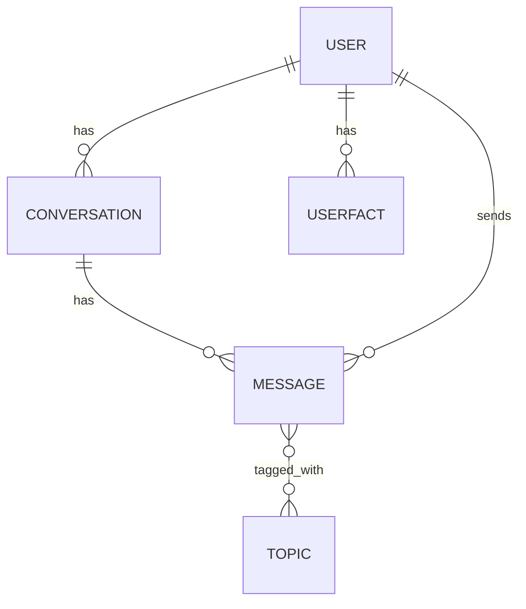

# Freya Backend ERD (Entity Relationship Diagram)

## Entity Overview

| Table        | Fields                                              | Relationships                                  |
|--------------|-----------------------------------------------------|------------------------------------------------|
| User         | id (PK), name, email, created_at                    | 1-to-many with Conversation, 1-to-many with UserFact |
| Conversation | id (PK), user_id (FK), started_at                   | Many-to-1 with User, 1-to-many with Message    |
| Message      | id (PK), conversation_id (FK), user_id (FK), content, timestamp | Many-to-1 with Conversation, Many-to-1 with User, Many-to-many with Topic |
| UserFact     | id (PK), user_id (FK), fact_type, value             | Many-to-1 with User                            |
| Topic        | id (PK), name                                       | Many-to-many with Message                      |
| MessageTopic | message_id (FK), topic_id (FK)                      | Join table for Message <-> Topic               |

## Mermaid Diagram

---

This ERD represents the initial database structure for the Freya backend, supporting user management, conversations, persistent user facts, messages, and topic tagging. Relationships and fields can be expanded as the project evolves.
